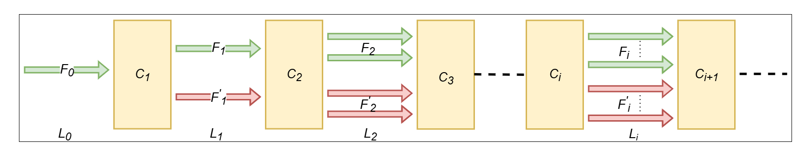

<!DOCTYPE html>
<html>

<body>

<h2>Optimal Transformations Selection Problem</h2>

This section focuses on the selection of those transformations that are statistically significant with positive correlation to the correct prediction of the model, referred to as optimal transformations in the remainder of this paper.

Let F denote the feature map at location L of the model and t denote a transformation set which has transformations like random vertical flip, random horizontal flip, random rotation, etc applied to obtain the transformed data. Then, the transformed feature map F' is defined as:

F' = t(F) (1)

Consider n arbitrary transformations t₁, t₂, ..., tₙ and the corresponding binary variables x = [x₁, x₂, ..., xₙ] which take value either 0 or 1. When xᵢ takes the value 1, then tᵢ is considered for performing the transformation on the feature maps. Let the input image (equivalent to the feature map at the input) be denoted as F₀. A logistic test [1] is used to identify the optimal transformations. For this, a binary response variable y,

y = { 1; correct image classification 0; incorrect image classification } (2)

and the probability of successfully classifying the image for a given x,

p(x) = p(y=1/x) (3)

are considered. As x can take 2ⁿ possible combinations of binary variables xᵢ, there will be a resultant probability value associated with each possible combination. As the value of p(x) is between 0 and 1 and xᵢ's are independent binary variables, they are fitted using the logistic regression model defined by

p(x) = exp(β₀ + Σβᵢxᵢ) / (1 + exp(β₀ + Σβᵢxᵢ)) (4)

Here β₀ to βₖ denote the coefficients of the model [1, 2]. Equation (4) can be rewritten in its logarithmic form as

ln(p(x)/(1 - p(x))) = β₀ + β₁x₁ + β₂x₂ + ... + βₙxₙ (5)

The estimates of the coefficients βₖ can be obtained by the maximum likelihood method [3]. Subsequently, a hypothesis test is conducted on the regression coefficients to evaluate the significance of the associated transformation. The significance of each transformation is analyzed using the hypothesis test.

H₀: βₖ = 0, H₁: βₖ ≠ 0 (6)

where H₀ represents the null hypothesis, and H₁ represents the alternative hypothesis. If the null hypothesis (H₀) is accepted (p > α), where α denotes the significance level, the transformation xᵢ, associated with the coefficient βᵢ, is not statistically significant in the model. Conversely, if the alternative hypothesis (H₁) is accepted (p < α), the transformation xᵢ shows statistical significance [2]. The sign of the coefficient (βᵢ) indicates whether the corresponding transformation has a positive or negative correlation to the model performance. Finally, those transformations with statistically significant positive coefficients are selected. This selected subset of available transformations at the input of the model is the optimal transformations at L₀, denoted as T₀, T₀ = { tᵢ ∈ T | xᵢ is significant with pᵢ < α and βᵢ > 0 }. The input feature map F₀ is transformed using the selected optimal transformation T₀,

F₀' = { T₀(F₀); if T₀ ≠ ∅ F₀; otherwise } (7)

where ∅ denotes a null set. The transformed feature map F₀' is fed to the next layer, i.e., unlike normal data augmentation, only the transformed version of the input is fed to the next layer.

Figure 1: Architecture showing location-wise feature augmentation with the light green highlighted feature maps indicating those considered for optimal transformation selection, and the red highlighted feature maps correspond to transformed feature maps.

<h2>Optimal Transformations Selection at Lᵢ</h2>

The optimal feature augmentation strategy can be divided into two-phase optimal feature selection phase and the actual model training phase.

Similar to finding optimal transformations at the input level (L₀), the approach can be extended to any intermediate level feature map Fᵢ at location Lᵢ. For this, first consider the features map F₁ (at L₁) defined as

F₁ = C₁(F₀') (8)

where C₁ denotes the convolution operation between L₀ and L₁. Similar to the input location L₀, at each intermediate location consider n arbitrary transformations t = t₁, t₂, ..., tₙ and the corresponding binary variables x = [x₁, x₂, ..., xₙ]. As discussed in the previous subsection, the coefficient values βᵢ and the corresponding p-value of the associated xᵢ in L₁ are computed. The resultant subset of optimal transformations at L₁ is denoted by T₁ and the corresponding transformed feature map is denoted by F'₁, where

F₁' = T₁(F₁) (9)

At the location L₁, augmented feature map F̃₁ is computed as

F̃₁ = { [F₁, F₁']; if T₁ ≠ ∅ F₁; otherwise } (10)

Using F̃₁ as the feature map at location L₁ and passing to the next layer of the model instead of F₁', in turn, doubles the computation for the rest of the model. Consequently, the feature map F₂ at location L₂ is given by

F₂ = C₂(F̃₁) (11)

where denoting C₂ as the convolution operation between locations L₁ and L₂. At location L₂, the selection of optimal features is performed using the feature map F₂ which has double the number of features compared to the feature map F₁. In the general case, the feature map at the location Lᵢ is given by

Fᵢ = Cᵢ(F̃ᵢ₋₁) (12)

where Cᵢ denotes the convolution block between locations Lᵢ₋₁ and Lᵢ and F̃ᵢ₋₁ is the augmented feature map at Lᵢ₋₁. With at least one transformation selected at each Lᵢ, Fᵢ has 2ⁱ⁻¹ times the number of feature maps as F₁. This Fᵢ is further used to find the set of optimal transformations Tᵢ at Lᵢ. Thus the augmented feature map at Lᵢ is given by

Fᵢ' = Tᵢ(Fᵢ) (13)

F̃ᵢ = { [Fᵢ, Fᵢ'], if Tᵢ ≠ ∅ Fᵢ, otherwise } (14)

</body>
</html>
